

 

# [Melox](https://github.com/Inefy-03/Melox)

#### An Android local music player based on <a href="https://github.com/compose-miuix-ui/miuix">Miuix</a>

---

## Overview

Melox is an Android local music player built with Jetpack Compose, Miuix, and AndroidX Media3.

## Screenshots

### Main screens
<table>
  <tr>
    <td>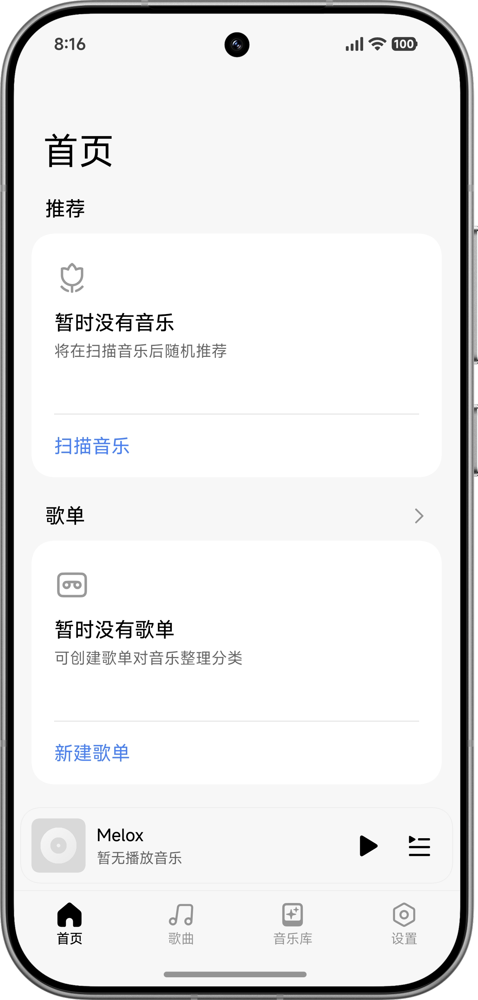</td>
    <td>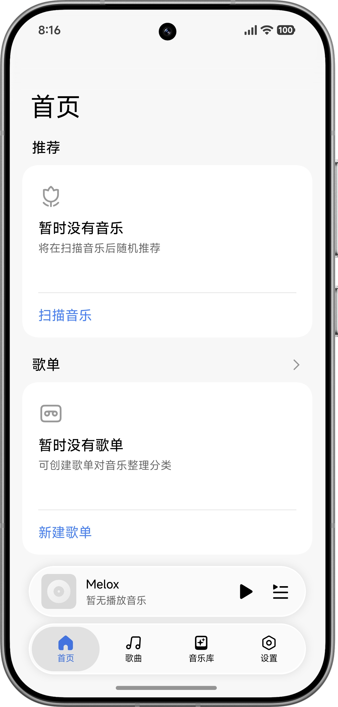</td>
    <td>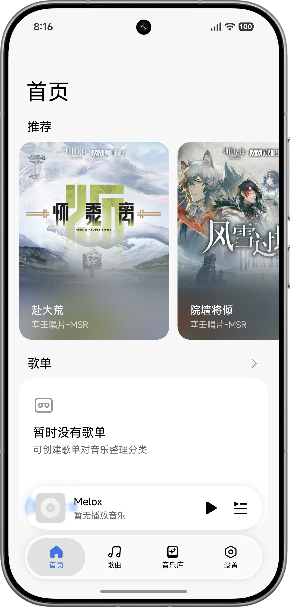</td>
    <td>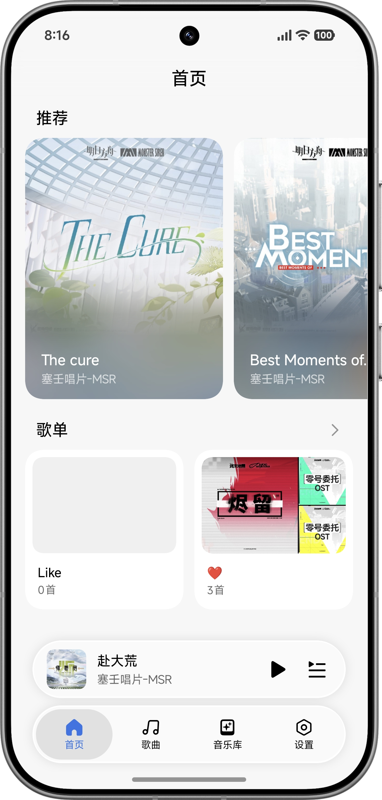</td>
  </tr>
  <tr>
    <td>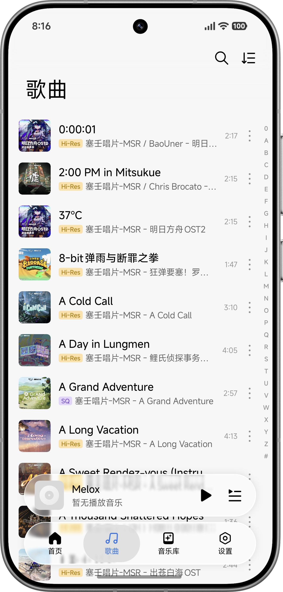</td>
    <td>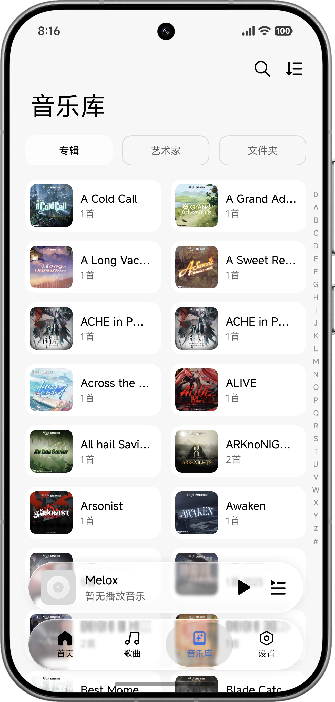</td>
    <td>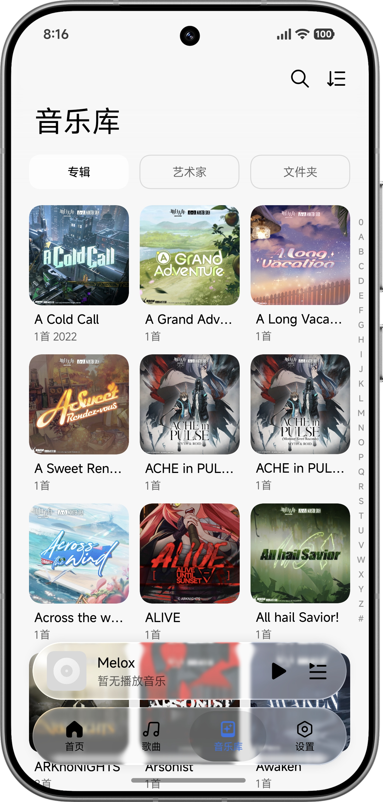</td>
    <td>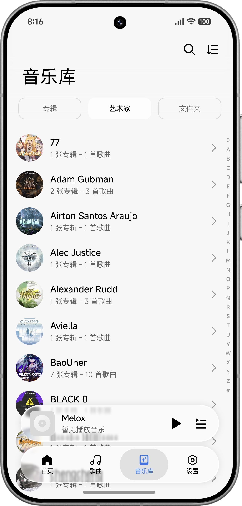</td>
  </tr>
  <tr>
    <td>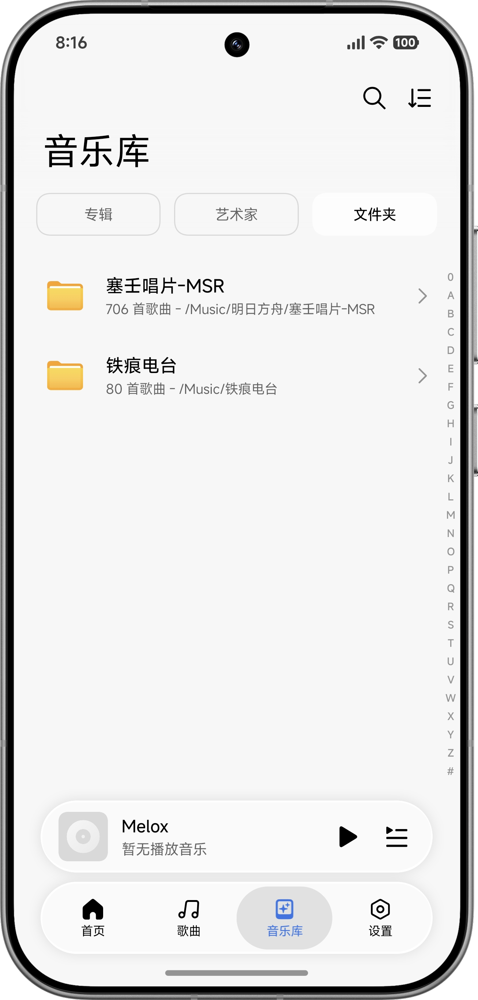</td>
    <td>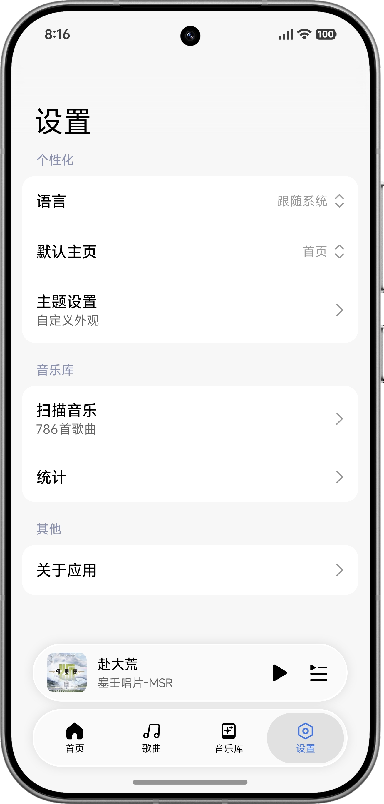</td>
    <td>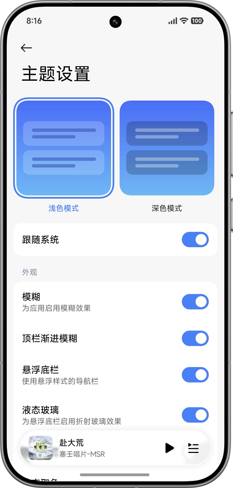</td>
    <td>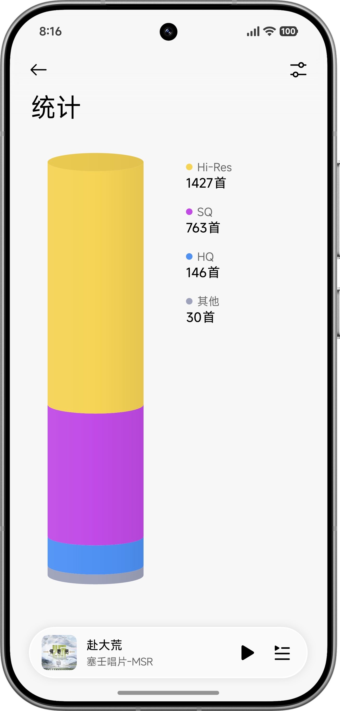</td>
  </tr>
</table>

### Player and lyrics

<table>
  <tr>
    <td>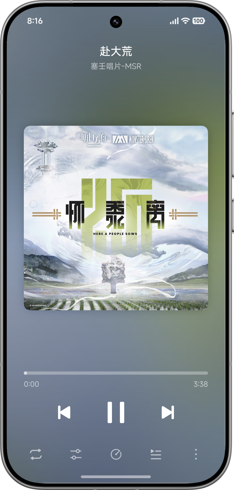</td>
    <td>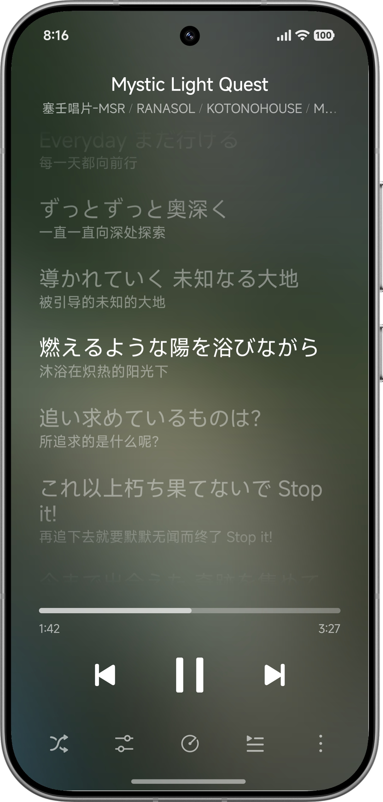</td>
    <td>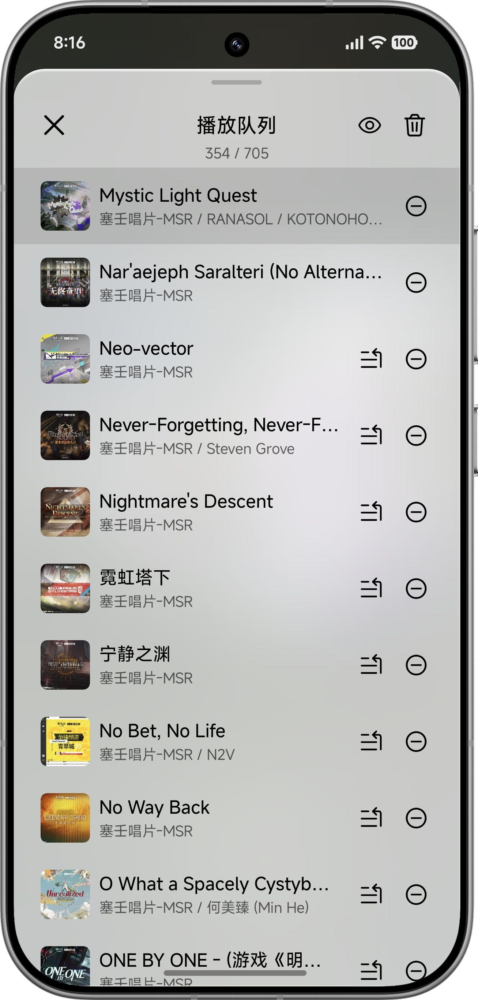</td>
    <td>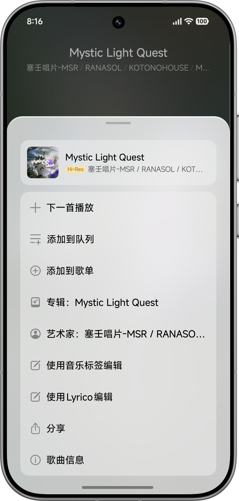</td>
  </tr>
</table>

<table>
  <tr>
    <td>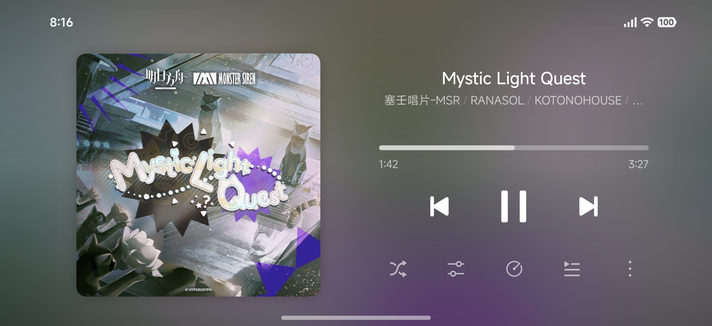</td>
    <td>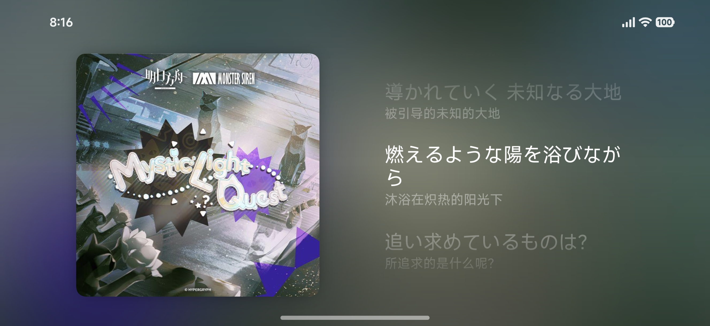</td>
  </tr>
</table>

## Requirements

- Android 9 (API 28) or later
- Liquid glass and other runtime visual effects require Android 13 or later

## Supported formats and permissions

- Supports common local audio formats such as AAC, ALAC, FLAC, M4A, MP3, MP4, and WAV
- The first scan requires music access: “Music and audio” on Android 13 or later, or storage read access on Android 12 and earlier
- When a custom folder is selected, grant access to that folder and its subdirectories through the system folder picker
- Current APKs are provided for `arm64-v8a` only

## Download and install

- Stable builds: download from [GitHub Releases](https://github.com/Inefy-03/Melox/releases)
- Test builds: follow the [Telegram channel](https://t.me/MeloxPlayer)

## Credits

- [Miuix](https://github.com/compose-miuix-ui/miuix) - UI components and design system
- [AndroidX Media3](https://developer.android.com/media/media3) - local playback and system media sessions

Melox is under active development. Report issues through [Issues](https://github.com/Inefy-03/Melox/issues) or submit a [Pull Request](https://github.com/Inefy-03/Melox/pulls).
